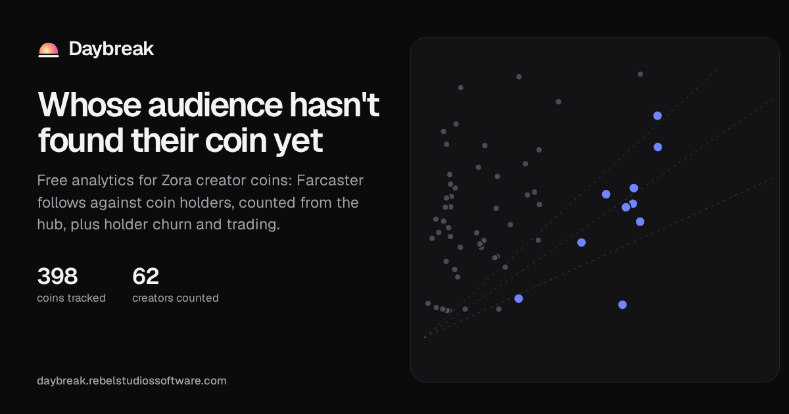

# Daybreak

Free analytics for Zora creator coins: **https://daybreak.rebelstudiossoftware.com**



- **Check your coin.** Any Zora handle, not only the coins tracked here. The holder count comes
  from Zora; the follower number is counted in your browser, live, by walking a public Farcaster
  node for every signed follow of the account, with the running total on screen. Then how that
  compares, the next step that fits those numbers, and a share card with the coin's art. Nothing
  is stored.
- **Who follows you and doesn't hold.** The one list a follower count can't give you: the people
  who follow a creator on Farcaster, publish a verified Ethereum address, and are not in their
  coin's holder list — by name, ranked by what they already buy, each with one drafted next step.
  Farcaster verifications are signed by the wallet itself, so a follower and a holder are the same
  kind of thing and can be subtracted. Nothing is ever posted for you.
- **The gap map.** Every creator with 1,000+ Farcaster follows plotted against their coin's
  holders. Big followings with few holders are audiences that haven't found the coin yet.
- **Gap leaderboard.** Creators ranked by how few of their follows hold, filterable by minimum
  holders. A creator whose follows we have not counted yet is absent rather than estimated.
- **Rewards.** Who Zora pays on every trade, read from Base: the split between creators, the
  apps that created and routed the coins, the protocol and Doppler, per day, with the top earners.
  Both reward events are decoded (`CoinMarketRewardsV4` and `CreatorCoinRewards`).
- **Tags.** Zora's tags (trend coins): what trades, what gains holders, and which tags share them.
- **Coin pages.** Holders over time, day-over-day holder churn, daily buy and sell volume,
  trading by weekday and hour, and how concentrated the supply is (the Uniswap v4 pool that
  holds each coin's liquidity is reported separately, not counted as a whale).

Also a Farcaster mini app (coin pages and the site open in the feed) and installable as an app.
Built on the same team's open-source [Zora coins SDKs](https://github.com/pgalyen1987/zora-coins-sdks)
([Python](https://github.com/pgalyen1987/zora-coins-py)).

Coin stats, holder lists and trades come from the public Zora coins API; rewards from Base's logs;
follower numbers from nowhere but our own count.

### About follower counts

Zora carries a follower count on every linked account and this site used to be built on them. They
do not hold up, and on 2026-09-21 we counted the Farcaster side ourselves for all 104 tracked
creators who have one linked, so we can say by how much. Of the 96 that also carry a Zora number,
**five are within 5%**; 65 are out by more than 1.5x, 11 by more than 3x, 6 by more than 5x, and
the worst by **32x**. Not one is too high — every Zora figure is at or below the real count, which
is what an unrefreshed snapshot looks like on accounts that only grow. They also do not move: 60 of
those counts across 39 creators were identical to the values Zora served three days earlier, on
accounts from 46 followers to 1.9M.

| Creator | Zora's profile | Farcaster's app | Follow records on the hub |
|---|---|---|---|
| @jacob | 292,097 | 92,145 | 478,377 |
| @balajis.eth | 186,832 | 60,670 | 304,164 |
| @crypticpoet | 12,169 | 5,998 | 34,941 |
| @kitty4d | 11 | 210 | 351 |
| @manuee | 2,789 | 1,476 | 2,966 |

So the site counts for itself: `collect.ts follows` walks a public Snapchain node for every signed,
unrevoked follow of a creator's Farcaster account and stores the total with the time it was taken.
That number is always called **Farcaster follows**, never "followers", and is stated as a ceiling —
a random sample of 400 of @jacob's 478,377 found 99.8% with a username and 98.8% with a profile
picture, so they are real accounts, but how many are still reading is not something anyone can
measure from the outside.

What was removed rather than fixed: the cross-platform "audience" figure (a creator's largest
linked account, which ranked an X follower count against a Farcaster follow count as if they
measured the same thing), "not yet holding" (followers minus holders, a subtraction between two
sets where neither contains the other), and the per-platform medians on the check page. Creators
whose audience is on X, Instagram or TikTok have no audience figure here at all, because none of
those can be counted without paying.

The [method page](https://daybreak.rebelstudiossoftware.com/method/) explains every number.
Not financial advice, and not affiliated with Zora.

## How it runs

There is no server. A GitHub Actions workflow runs every hour:

1. downloads the SQLite database from the `data` release,
2. collects coin stats and new trades (`scripts/collect.ts`), every reward payout from Base's
   logs, Zora's tags, once a day each coin's holder set, Farcaster follow counts walked from the
   public hub (`collect.ts follows`, stalest first within a time budget), and the follower diffs
   (`scripts/audience.ts`),
3. prunes old rows and saves the database back to the release,
4. builds the site as static files (`next build` with `output: "export"`) and publishes it
   to GitHub Pages.

## Develop

```bash
npm install
npm run collect          # fills data/coinlens.sqlite (a few minutes; ZORA_API_KEY optional)
npm run dev              # http://localhost:3000
npm test
npm run build && npm run serve   # the static site, as Pages serves it

npx tsx scripts/audience.ts jacob        # who follows @jacob and doesn't hold, into public/audience/
npx tsx scripts/audience.ts @someone     # a Farcaster username directly, for a creator not on Zora
```

`audience.ts` walks the public Snapchain node for every signed follow, resolves each follower to
their verified wallets, and subtracts the coin's holder list. Resolving a follower costs one
request and a large account has hundreds of thousands, so the answers live in a shared index in
the SQLite file (`fids`, `fid_wallets`) and each run tops it up by `--budget`; coverage climbs
hourly and every page says how much of its follower list has actually been checked.

This only works on Farcaster. Instagram and TikTok publish neither a follower list nor a wallet,
and X charges per call for follower access.

Built by [Rebel Studios](https://rebelstudiossoftware.com).
